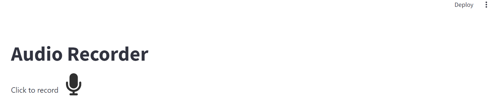
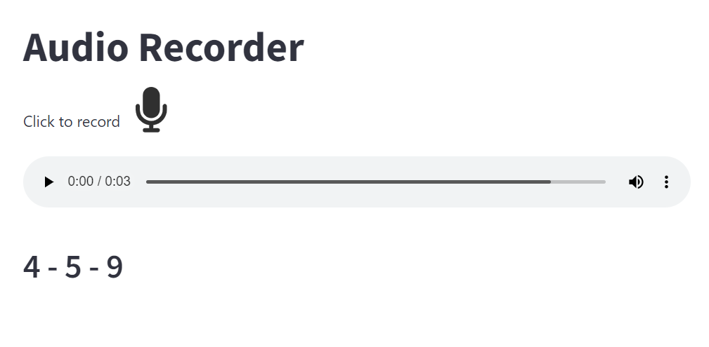

# speech_mnist
Our speech mnist helps us in turning audio of numbers 0-9 into their digits. This app allows you to record a voice and say a number between ziro and nine and it will predict what your number is. It also will detect multiple numbers and seperate every number and gives you every spoken number.

 ## pre-requesties
 For using this example, you should install some packages. These packages are being used for generating our model
 ```bash
pip install numpy tensorflow pandas matplotlib scipy scikit-learn
 ```

To run this application, we use streamlit. Also for recording voices we use an open source repository named [audio_recorder_streamlit](https://github.com/Joooohan/audio-recorder-streamlit). to wirk with `wav` file type we use pydub. To install these packages we will use the following command.
 ```bash
 pip install pydub audio_recorder_streamlit streamlit
 ```

## How to Use
After installing the pre-requesties, you should create the model. You could either train the model or download it from my [drive](https://drive.google.com/file/d/1UPLySIuyfGDwa5dMILS5qCEtKBxWE17j/view?usp=sharing). To train the model, you should download the dataset from [Kaggle](https://www.kaggle.com/datasets/sripaadsrinivasan/audio-mnist). Then put the `data` folder in a folder named `Audio`. 
Now you should run the `data_loader.ipynb` notebook line by line. Be careful that this notebook has high usage of RAM and CPU.
After training our model, You could run our application with the following command
```bash
streamlit run audio_listner.py
```
A web page like this will be open on address `http://localhost:8501/` on your browser

With pressing on mic logo, your voice will be recorded. After that, our application will give you the numbers you have said. The result will be something like this
